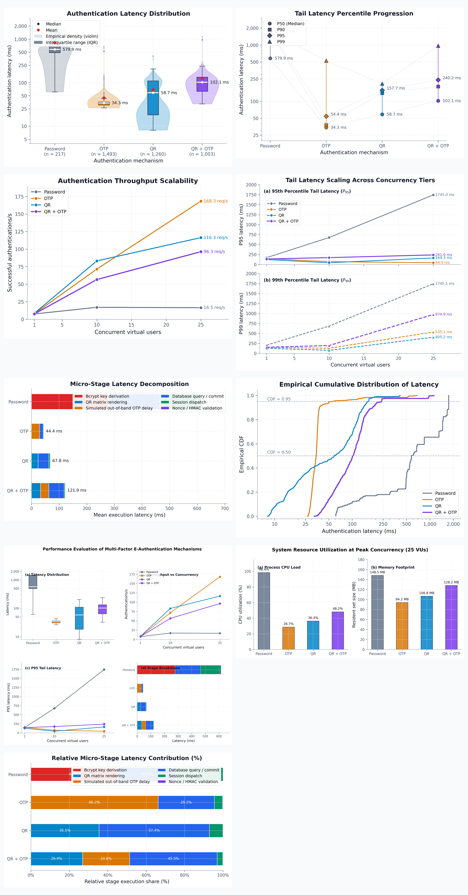

# Academic Performance Figures: Publication Compendium

This compendium contains the complete suite of publication-grade figures for the research study:

> **“Empirical Performance Evaluation of Multi-Factor E-Authentication Mechanisms (QR Code, OTP, and Hybrid QR+OTP)”**

All visuals are rendered at 300 DPI, conform to IEEE/ACM systems research styling, and are available in raster PNG, vector SVG, and vector PDF formats.

---

### Master Preview Sheet

*High-resolution composite preview containing all empirical performance figures.*

---

## Figure 1: Authentication Latency Distribution

**Formats:** [PNG (300 DPI)](figures/fig1_latency_distribution.png) | [Vector SVG](figures/fig1_latency_distribution.svg) | [Vector PDF](figures/fig1_latency_distribution.pdf)

> **Paper Caption:**  
> *Distribution of end-to-end authentication latency across four authentication mechanisms under controlled benchmark conditions ($N = 3,973$). The violin envelope reflects kernel empirical density; internal boxes depict the interquartile range (IQR, $P_{25}$ to $P_{75}$); solid white markers denote sample medians ($P_{50}$); and red diamonds indicate sample means ($ar{x}$). Outlying points beyond $1.5 	imes 	ext{IQR}$ are displayed with alpha transparency. The ordinate is plotted on a logarithmic scale.*

---

## Figure 2: Tail Latency Percentile Progression

**Formats:** [PNG (300 DPI)](figures/fig2_tail_latency_breakdown.png) | [Vector SVG](figures/fig2_tail_latency_breakdown.svg) | [Vector PDF](figures/fig2_tail_latency_breakdown.pdf)

> **Paper Caption:**  
> *Percentile dot plot illustrating tail latency dispersion across the 50th, 90th, 95th, and 99th percentiles for each evaluated authentication scheme. Solid vertical spines connect the median ($P_{50}$) to the extreme tail ($P_{99}$). Horizontal dotted reference paths trace percentile evolution across architectures on a logarithmic ordinate scale.*

---

## Figure 3: Authentication Throughput Scalability

**Formats:** [PNG (300 DPI)](figures/fig3_throughput_vs_concurrency.png) | [Vector SVG](figures/fig3_throughput_vs_concurrency.svg) | [Vector PDF](figures/fig3_throughput_vs_concurrency.pdf)

> **Paper Caption:**  
> *Sustained authentication throughput ($	ext{successful authentications/s}$) as a function of concurrent virtual users (1, 10, and 25 VUs) targeting a dedicated PostgreSQL 18.3 relational engine. End-point annotations report steady-state capacity at peak concurrency.*

---

## Figure 4: Tail Latency Scaling Across Concurrency Tiers

**Formats:** [PNG (300 DPI)](figures/fig4_p95_vs_concurrency.png) | [Vector SVG](figures/fig4_p95_vs_concurrency.svg) | [Vector PDF](figures/fig4_p95_vs_concurrency.pdf)

> **Paper Caption:**  
> *Evolution of high-quantile tail latency under increasing concurrency tiers: (a) 95th percentile latency ($P_{95}$) and (b) 99th percentile latency ($P_{99}$). Markers denote measured empirical quantiles; end annotations indicate peak-load tail figures.*

---

## Figure 5: Micro-Stage Latency Decomposition

**Formats:** [PNG (300 DPI)](figures/fig5_substage_decomposition.png) | [Vector SVG](figures/fig5_substage_decomposition.svg) | [Vector PDF](figures/fig5_substage_decomposition.pdf)

> **Paper Caption:**  
> *Horizontal stacked bar chart breaking down mean end-to-end server latency into constituent micro-operations ($N = 35,058$ total measured stages). Distinct color swatches identify cryptographic key stretching, QR visual matrix synthesis, simulated out-of-band delivery, atomic database transactions, session allocation, and nonce/HMAC validation.*

---

## Figure 6: Empirical Cumulative Distribution of Latency

**Formats:** [PNG (300 DPI)](figures/fig6_latency_ecdf.png) | [Vector SVG](figures/fig6_latency_ecdf.svg) | [Vector PDF](figures/fig6_latency_ecdf.pdf)

> **Paper Caption:**  
> *Empirical cumulative distribution function (ECDF) curves comparing cumulative latency probabilities across all four authentication architectures. Dashed horizontal reference lines delineate the median ($	ext{CDF} = 0.50$) and 95th percentile ($	ext{CDF} = 0.95$) thresholds on a logarithmic abscissa.*

---

## Figure 8: Composite Academic Summary

**Formats:** [PNG (300 DPI)](figures/fig8_composite_academic_summary.png) | [Vector SVG](figures/fig8_composite_academic_summary.svg) | [Vector PDF](figures/fig8_composite_academic_summary.pdf)

> **Paper Caption:**  
> *Unified four-panel empirical performance overview formatted for two-column conference/journal submissions: (a) Latency distribution box plots; (b) Throughput scalability curves; (c) 95th percentile tail latency scaling; and (d) Micro-stage latency decomposition.*

---

## Figure 9: System Resource Utilization Under Peak Concurrency

**Formats:** [PNG (300 DPI)](figures/fig9_resource_utilization.png) | [Vector SVG](figures/fig9_resource_utilization.svg) | [Vector PDF](figures/fig9_resource_utilization.pdf)

> **Paper Caption:**  
> *Server-side system resource footprint under peak concurrency (25 VUs): (a) Process CPU load (%) showing core saturation in password hashing; and (b) Process resident set size (RSS in MB) illustrating memory efficiency.*

---

## Figure 10: Relative Micro-Stage Latency Contribution (%)

**Formats:** [PNG (300 DPI)](figures/fig10_stage_contribution_percentage.png) | [Vector SVG](figures/fig10_stage_contribution_percentage.svg) | [Vector PDF](figures/fig10_stage_contribution_percentage.pdf)

> **Paper Caption:**  
> *Normalized 100% horizontal stacked bar chart showing the relative percentage share of each internal micro-stage computed from cumulative measured stage execution time ($N = 35,058$ total measured stages).*
