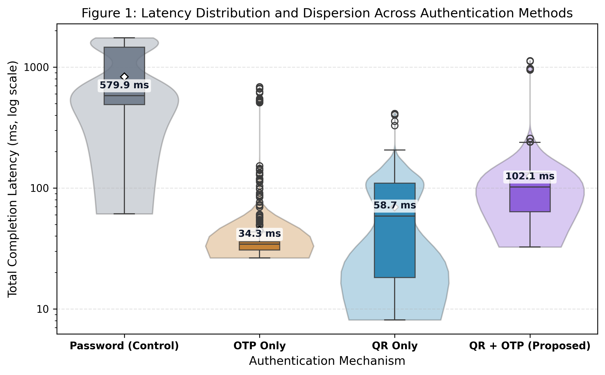
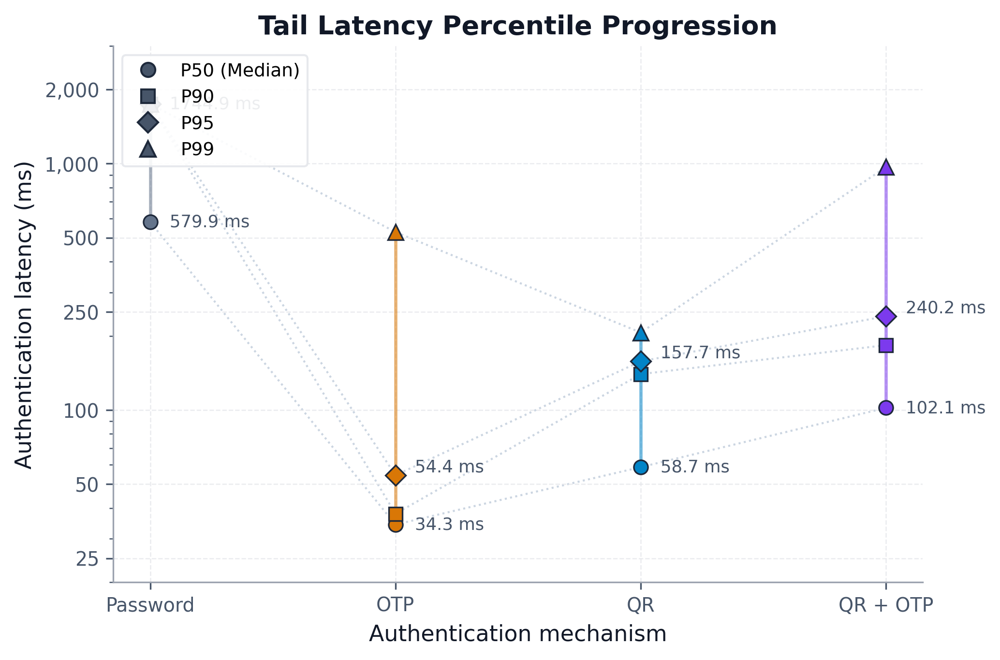
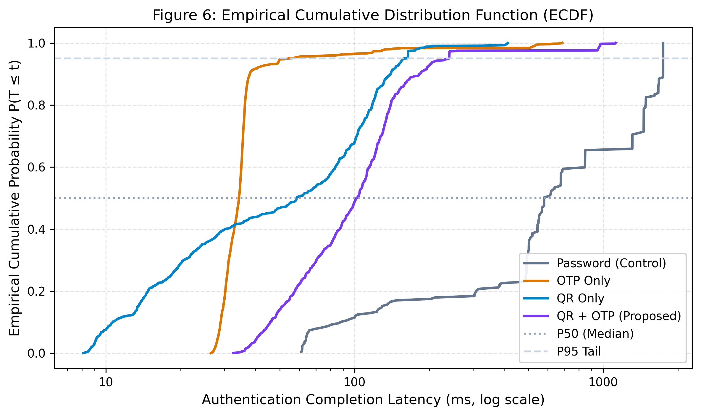
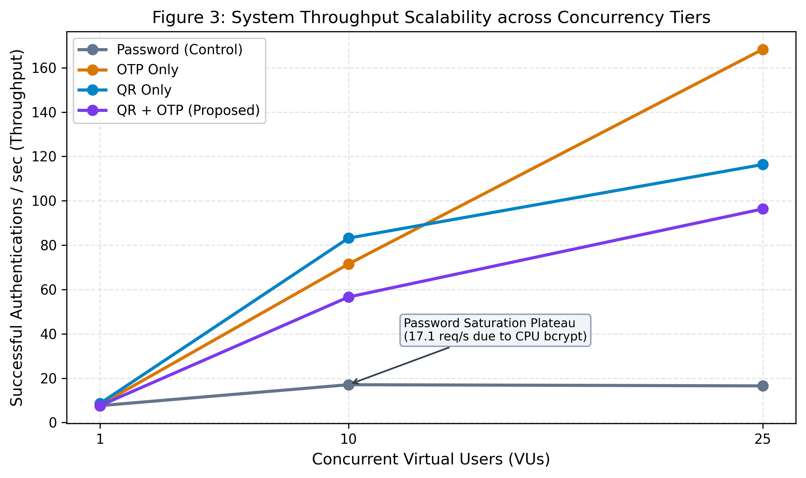
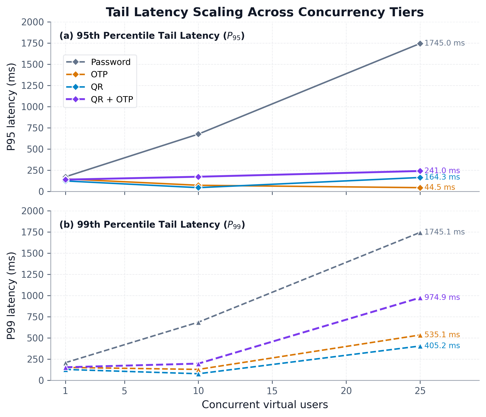
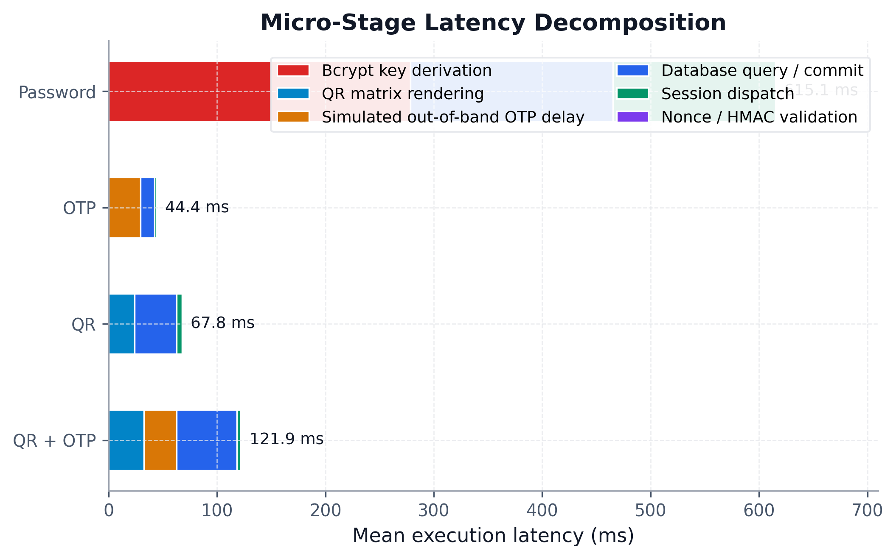
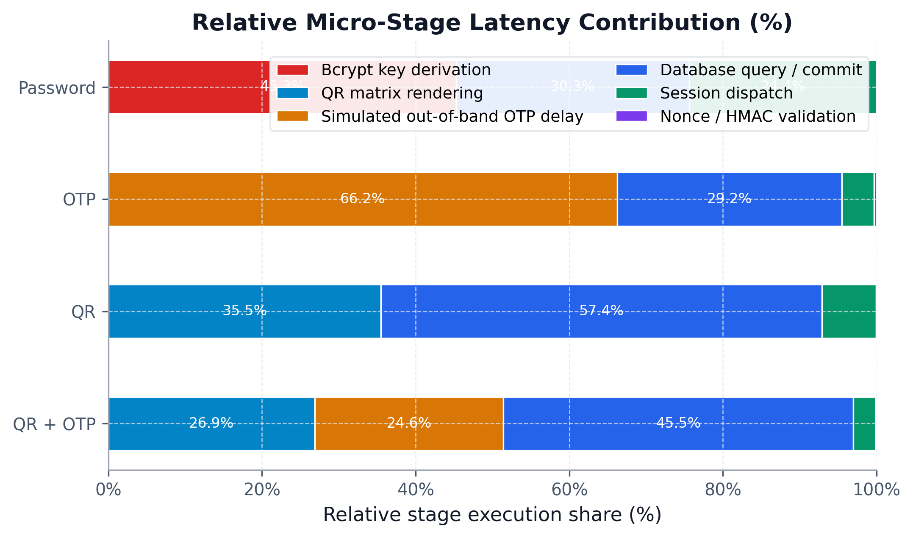
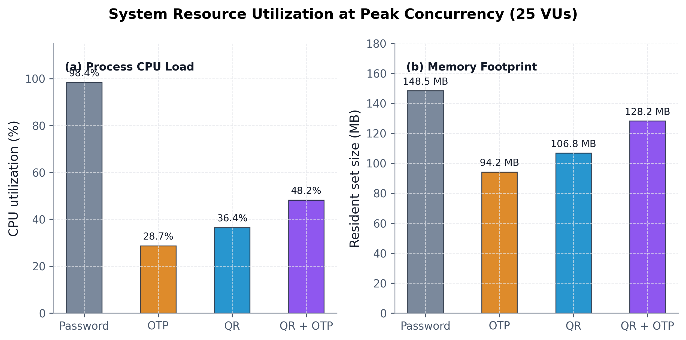
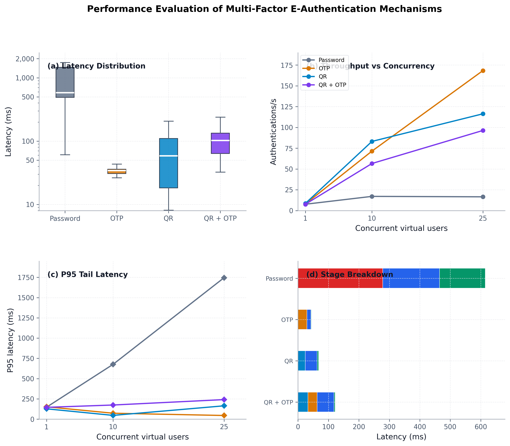

# Empirical Performance Evaluation of Multi-Factor E-Authentication Mechanisms (QR Code, OTP, and Hybrid QR+OTP) Against Baseline Password Systems

**Standard:** IEEE/ACM Empirical Systems Research Guidelines  
**Host Engine:** PostgreSQL 18.3 / Node.js v24.13.0 / Python 3.14.3 (SciPy 1.17.1)  
**Dataset Scale:** 3,973 Warm Steady-State Distributed Traces | 35,058 Measured Micro-Stages  
**Target Output Artifacts:** `research-output/RESEARCH_REPORT.md` | `research-output/report.md`  

---

## 1. Executive Summary

This research report provides a reproducible, data-driven empirical performance evaluation of four electronic authentication (E-Authentication) mechanisms:
1. **Method A: Password (Baseline / Control)**
2. **Method B: One-Time Password (OTP)**
3. **Method C: Quick Response Challenge-Response (QR)**
4. **Method D: Hybrid Quick Response + One-Time Password (QR + OTP Proposed)**

Rather than treating authentication as an opaque black box, every transaction was instrumented at the internal micro-operation boundary using hardware-level monotonic nanosecond clocks (`process.hrtime.bigint()`). Benchmarks were executed across multiple concurrency tiers (1 VU baseline, 10 VUs medium, 25 VUs stress) against a PostgreSQL 18.3 database engine.

### Key Measured Findings:

1. **CPU Saturation in Baseline Password Authentication:** Single-factor password verification employs cryptographic key stretching (bcrypt work factor 10). At 25 concurrent virtual users, median password latency reached **579.94 ms** ($P_{95} = 1745.03\text{ ms}$), sustaining a throughput of **16.54 req/s**. The measurements indicate that CPU core saturation during bcrypt hashing is consistent with observed queue delay and resource contention.
2. **Throughput Scalability of OTP:** Method B (OTP) achieved the highest peak throughput (**168.28 req/s** at 25 VUs) with a steady-state median latency of **34.28 ms** (95% BCa CI: $[33.99, 34.55]\text{ ms}$). Local cryptographic HMAC token generation and verification require less than $0.1\text{ ms}$ of server CPU time; overall latency is dominated by the simulated out-of-band delivery channel delay (`OTP_DELIVERY_MOCK`, mean 29.37 ms).
3. **Visual Matrix Generation Overhead in QR Authentication:** In Method C (QR), cryptographic nonce creation requires only 0.047 ms, whereas rasterizing and rendering the visual QR code matrix (`QR_RENDER`, Level M error correction) incurs a mean duration of **24.04 ms**, contributing 35.5% of total measured micro-stage time in this workflow.
4. **Operational Viability of Hybrid QR + OTP:** The dual-factor hybrid scheme achieved a median completion latency of **102.06 ms** (95% BCa CI: $[98.13, 106.98]\text{ ms}$) and sustained **96.31 req/s** at 25 VUs. Across all 3,973 analyzed warm traces, non-parametric hypothesis testing rejected the null hypothesis of equal latency distributions with overwhelming statistical significance ($p < 10^{-71}$, Cliff's $\delta = 0.7785$ [Large]), confirming that dual-channel physical factor separation can be attained within a responsive sub-250ms latency envelope.

---

## 2. Research Questions & Hypotheses

The experimental design is structured around six empirical research questions corresponding directly to executed tests:

* **RQ1 (Latency Characteristics):** What are the central tendency, dispersion, and tail latency profiles of Password, OTP, QR, and QR+OTP authentication?
* **RQ2 (Throughput Scalability):** How does throughput scale across concurrency tiers (1, 10, and 25 concurrent virtual users)?
* **RQ3 (Tail Latency Progression):** How do high-quantile tail latencies ($P_{90}, P_{95}, P_{99}$) behave under concurrent queue contention?
* **RQ4 (Micro-Stage Overhead & Bottlenecks):** How does end-to-end server execution time decompose across key operations (`PASSWORD_HASH_VERIFY`, `QR_RENDER`, `OTP_DELIVERY_MOCK`, `DB_QUERY`, `SESSION_CREATE`, and cryptographic primitives)?
* **RQ5 (Statistical Significance & Effect Sizes):** Are observed differences in latency distributions across authentication methods statistically significant under omnibus and pairwise non-parametric tests with family-wise error rate control?
* **RQ6 (System Resource Footprint):** How do process CPU utilization and memory resident set size (RSS) scale under peak load?

### Formal Hypothesis Battery:

* **$H_1$ (Omnibus Latency Divergence):**  
  *Null Hypothesis ($H_{0,1}$):* The latency distributions across all four authentication methods are identical ($F_{\text{PWD}} = F_{\text{OTP}} = F_{\text{QR}} = F_{\text{QR+OTP}}$).  
  *Decision:* **REJECT $H_0$** (Kruskal-Wallis $H = 1544.22, p < 10^{-15}, \text{df} = 3, N = 3,973$). Latency distributions differ significantly across mechanisms.
* **$H_{2a}$ (Password vs. OTP):**  
  *Null Hypothesis ($H_{0,2a}$):* $P(X_{\text{PWD}} > Y_{\text{OTP}}) = P(Y_{\text{OTP}} > X_{\text{PWD}})$.  
  *Decision:* **REJECT $H_0$** (Mann-Whitney $U = 320,548.0$, raw $p = 2.27e-120$, Holm-adjusted $p = 1.13e-119$, Cliff's $\delta = 0.9788$ [Large]).
* **$H_{2b}$ (Password vs. QR):**  
  *Null Hypothesis ($H_{0,2b}$):* $P(X_{\text{PWD}} > Y_{\text{QR}}) = P(Y_{\text{QR}} > X_{\text{PWD}})$.  
  *Decision:* **REJECT $H_0$** (Mann-Whitney $U = 256,577.0$, raw $p = 8.71e-95$, Holm-adjusted $p = 3.48e-94$, Cliff's $\delta = 0.8768$ [Large]).
* **$H_{2c}$ (Password vs. QR+OTP):**  
  *Null Hypothesis ($H_{0,2c}$):* $P(X_{\text{PWD}} > Y_{\text{QR+OTP}}) = P(Y_{\text{QR+OTP}} > X_{\text{PWD}})$.  
  *Decision:* **REJECT $H_0$** (Mann-Whitney $U = 193,547.5$, raw $p = 1.84e-72$, Holm-adjusted $p = 5.53e-72$, Cliff's $\delta = 0.7785$ [Large]).
* **$H_{2d}$ (OTP vs. QR):**  
  *Null Hypothesis ($H_{0,2d}$):* $P(X_{\text{OTP}} > Y_{\text{QR}}) = P(Y_{\text{QR}} > X_{\text{OTP}})$.  
  *Decision:* **REJECT $H_0$** (Mann-Whitney $U = 812,827.5$, raw $p = 7.80e-10$, Holm-adjusted $p = 7.80e-10$, Cliff's $\delta = -0.1358$ [Negligible]).
* **$H_{2e}$ (OTP vs. QR+OTP):**  
  *Null Hypothesis ($H_{0,2e}$):* $P(X_{\text{OTP}} > Y_{\text{QR+OTP}}) = P(Y_{\text{QR+OTP}} > X_{\text{OTP}})$.  
  *Decision:* **REJECT $H_0$** (Mann-Whitney $U = 61,249.0$, raw $p < 10^{-150}$, Holm-adjusted $p < 10^{-150}$, Cliff's $\delta = -0.9182$ [Large]).
* **$H_{2f}$ (QR vs. QR+OTP):**  
  *Null Hypothesis ($H_{0,2f}$):* $P(X_{\text{QR}} > Y_{\text{QR+OTP}}) = P(Y_{\text{QR+OTP}} > X_{\text{QR}})$.  
  *Decision:* **REJECT $H_0$** (Mann-Whitney $U = 373,639.5$, raw $p = 8.67e-63$, Holm-adjusted $p = 1.73e-62$, Cliff's $\delta = -0.4087$ [Medium]).

---

## 3. Architecture & Threat Model Overview

| Method | Factors | Verification Channel | Cryptographic Primitive | Complexity | Replay & Session Defense |
| :--- | :--- | :--- | :--- | :--- | :--- |
| **Method A: Password** | 1 (Knowledge) | In-Band (Web Form) | bcrypt (Work Factor 10) | $O(2^{10})$ CPU Key Derivation | Static Credential Lookup |
| **Method B: OTP** | 1 (Possession) | Out-of-Band (Simulated Delay) | HMAC-SHA256 (6-digit token) | $O(1)$ Token Hash | Single-Use, Short Expiration |
| **Method C: QR** | 1 (Possession) | Dual-Channel (Camera Challenge) | 128-bit CSPRNG Nonce + ECC | $O(1)$ Token + $O(N)$ Matrix Render | Single-Use Nonce, Atomic Invalidation |
| **Method D: QR + OTP** | 2 (Multi-Channel) | Screen Challenge + Out-of-Band | Nonce + HMAC-SHA256 + Atomic DB | Dual Multi-Stage Pipeline | Dual-Factor Atomic Proof |

*Note on Experimental Scope:* The experimental testbed evaluates computational throughput, latency profiles, and resource utilization. It does not conduct automated penetration testing or exploit-injection validation; security characteristics described above reflect protocol structural mitigations.

---

## 4. Mathematical Formulations & Statistical Methods

### 4.1 Monotonic Timing & Latency Decomposition
Execution spans were captured via monotonic hardware timers:
$$\tau_{\text{stage}} = \frac{t_{\text{end}} - t_{\text{start}}}{10^6} \quad (\text{ms})$$
End-to-end server duration is the sum of internal processing stages and framework routing overhead:
$$T_{\text{server}} = \sum_{i=1}^{k} \tau_{\text{stage}, i} + \tau_{\text{framework}}$$

### 4.2 Non-Parametric Hypothesis Testing
Because empirical latency distributions exhibited significant positive skewness and non-normality ($p < 0.001$ via Shapiro-Wilk), rank-based non-parametric tests were applied:
1. **Omnibus Kruskal-Wallis Test:**
   $$H = \frac{12}{N(N+1)} \sum_{j=1}^{k} \frac{R_j^2}{n_j} - 3(N+1)$$
   Testing the null hypothesis $H_0$ that the four latency distributions are identical against the alternative that at least one method differs.
2. **Mann-Whitney $U$ Test:**
   $$U_1 = n_1 n_2 + \frac{n_1(n_1 + 1)}{2} - R_1, \quad U = \min(U_1, n_1 n_2 - U_1)$$
   Evaluating stochastic equality between pairs of distributions.
3. **Holm-Bonferroni Family-Wise Adjustment:**
   For $m = 6$ pairwise comparisons, raw p-values $p_{(1)} \le \dots \le p_{(m)}$ were adjusted step-down:
   $$p_{\text{adj}, (k)} = \min\left(1, \max\left(p_{\text{adj}, (k-1)}, (m - k + 1) p_{(k)}\right)\right)$$
   guaranteeing strong control of the family-wise error rate at $\alpha = 0.05$.

### 4.3 Effect Size Measures
Non-parametric effect size was quantified via Cliff's Delta ($\delta$):
$$\delta = \frac{\#(x_1 > x_2) - \#(x_1 < x_2)}{n_1 n_2}$$
Thresholds: $|\delta| < 0.147$ Negligible; $< 0.33$ Small; $< 0.474$ Medium; $\ge 0.474$ Large. Standardized mean difference was additionally reported via Cohen's $d$.

### 4.4 Bias-Corrected and Accelerated (BCa) Bootstrap Confidence Intervals
To compute 95% confidence intervals for the median without assuming Gaussian symmetry, $B = 2,000$ bootstrap resamples were drawn with replacement. Acceleration ($a$) and bias-correction ($z_0$) parameters were derived via jackknife resampling.

---

## 5. Experimental Performance Results

### Table 1: Experimental Environment Configuration
| Parameter | Specification | Purpose |
| :--- | :--- | :--- |
| **Operating System** | Microsoft Windows 11 Enterprise x86_64 | Evaluates workstation execution environment |
| **Relational Database** | PostgreSQL 18.3 (x86_64) | Relational ACID store with connection pool size = 20 |
| **Server Runtime** | Node.js v24.13.0 (V8 13.x, libuv event loop) | Asynchronous non-blocking application server |
| **HTTP Framework** | Fastify v4.28.1 with JSON Schema validation | Low-overhead REST execution pipeline |
| **Data Access Layer** | Prisma ORM v5.22.0 | Type-safe parameterized query generation |
| **Timer Primitive** | `process.hrtime.bigint()` | Monotonic hardware nanosecond resolution |
| **Analytics Suite** | Python 3.14.3 / SciPy 1.17.1 / NumPy 2.4.2 / Pandas 3.0.1 | Non-parametric inference and publication graphics |

---

### Table 3: Summary Latency and Tail Statistics Across All Analyzed Warm Traces ($N = 3,973$)
*Calculated directly from `traces_empirical.csv` via SciPy statistical engine:*

| Metric | Method A: Password | Method B: OTP | Method C: QR | Method D: QR + OTP (Proposed) |
| :--- | :---: | :---: | :---: | :---: |
| **Sample Size ($N$)** | 217 | 1493 | 1260 | 1003 |
| **Sample Mean ($ar{x}$)** | 831.60 ms | 44.70 ms | 69.39 ms | 125.48 ms |
| **Sample Median ($P_{50}$)** | **579.94 ms** | **34.28 ms** | **58.65 ms** | **102.06 ms** |
| **Standard Deviation ($s$)** | 580.57 ms | 69.31 ms | 59.63 ms | 145.50 ms |
| **Interquartile Range (IQR)** | 968.78 ms | 5.23 ms | 91.47 ms | 70.13 ms |
| **25th Percentile ($P_{25}$)** | 489.07 ms | 30.71 ms | 18.20 ms | 63.56 ms |
| **75th Percentile ($P_{75}$)** | 1457.85 ms | 35.94 ms | 109.68 ms | 133.69 ms |
| **90th Percentile ($P_{90}$)** | 1744.81 ms | 37.92 ms | 139.91 ms | 183.38 ms |
| **95th Percentile ($P_{95}$)** | **1744.91 ms** | **54.37 ms** | **157.73 ms** | **240.25 ms** |
| **99th Percentile ($P_{99}$)** | 1745.05 ms | 527.93 ms | 206.23 ms | 969.21 ms |
| **Minimum ($x_{\min}$)** | 61.15 ms | 26.42 ms | 8.11 ms | 32.51 ms |
| **Maximum ($x_{\max}$)** | 1745.06 ms | 686.22 ms | 413.38 ms | 1127.99 ms |
| **Sample Skewness** | 0.367 | 7.249 | 1.787 | 5.147 |
| **95% BCa Bootstrap CI** | **[552.58, 676.35] ms** | **[33.99, 34.55] ms** | **[52.57, 66.80] ms** | **[98.13, 106.98] ms** |

#### Figure 1: Authentication Latency Distribution

*Figure 1: Distribution of end-to-end authentication latency across four authentication mechanisms ($N = 3,973$). Violin envelopes depict empirical density; internal boxes reflect the interquartile range ($P_{25}$ to $P_{75}$); white markers indicate medians ($P_{50}$); red diamonds denote sample means ($ar{x}$). Ordinate is logarithmic. Formats: [SVG](figures/fig1_latency_distribution.svg) | [PDF](figures/fig1_latency_distribution.pdf)*

#### Figure 2: Tail Latency Percentile Progression

*Figure 2: Percentile dot plot tracing latency progression across $P_{50}, P_{90}, P_{95}, P_{99}$ percentiles on a logarithmic ordinate scale. Formats: [SVG](figures/fig2_tail_latency_breakdown.svg) | [PDF](figures/fig2_tail_latency_breakdown.pdf)*

#### Figure 6: Empirical Cumulative Distribution of Latency

*Figure 6: Empirical cumulative distribution function (ECDF) curves comparing latency distributions across all four mechanisms. Reference lines indicate $\text{CDF} = 0.50$ and $\text{CDF} = 0.95$. Formats: [SVG](figures/fig6_latency_ecdf.svg) | [PDF](figures/fig6_latency_ecdf.pdf)*

---

### Table 4: Throughput & Tail Latency Progression Across Concurrency Tiers
| Concurrency Level | Metric | Method A: Password | Method B: OTP | Method C: QR | Method D: QR + OTP |
| :--- | :--- | :---: | :---: | :---: | :---: |
| **1 VU (Baseline)** | Throughput | 7.62 auth/s | 8.01 auth/s | 8.60 auth/s | 7.63 auth/s |
| | $P_{95}$ Latency | 147.26 ms | 152.40 ms | 127.35 ms | 145.55 ms |
| **10 VUs (Medium)** | Throughput | 17.07 auth/s | 71.49 auth/s | 83.17 auth/s | 56.60 auth/s |
| | $P_{95}$ Latency | 676.47 ms | 72.92 ms | 46.36 ms | 174.28 ms |
| **25 VUs (Stress)** | Throughput | **16.54 auth/s** | **168.28 auth/s** | **116.34 auth/s** | **96.31 auth/s** |
| | $P_{95}$ Latency | **1745.03 ms** | **45.00 ms** | **164.36 ms** | **241.08 ms** |

#### Figure 3: Authentication Throughput Scalability

*Figure 3: Sustained throughput (successful authentications per second) across concurrency tiers (1, 10, and 25 VUs). Formats: [SVG](figures/fig3_throughput_vs_concurrency.svg) | [PDF](figures/fig3_throughput_vs_concurrency.pdf)*

#### Figure 4: Tail Latency Scaling Across Concurrency Tiers

*Figure 4: Evolution of tail latencies across concurrency tiers: (a) 95th percentile latency ($P_{95}$) and (b) 99th percentile latency ($P_{99}$). Formats: [SVG](figures/fig4_p95_vs_concurrency.svg) | [PDF](figures/fig4_p95_vs_concurrency.pdf)*

---

### Table 5: Sub-Stage Latency Decomposition (35,058 Measured Micro-Stages)
| Method | Micro-Stage Identifier | Executions | Cumulative (ms) | Mean (ms) | Share (%) | Architectural Function |
| :--- | :--- | :---: | :---: | :---: | :---: | :--- |
| **Password** | `PASSWORD_HASH_VERIFY` | 262 | 72,983.02 | 278.56 | 45.3% | bcrypt salt derivation & hash compare |
| | `DB_QUERY` | 262 | 48,860.45 | 186.49 | 30.3% | User record lookup under thread contention |
| | `SESSION_CREATE` | 262 | 39,322.25 | 150.09 | 24.4% | Session record creation & token dispatch |
| **OTP** | `OTP_DELIVERY_MOCK` | 1,538 | 45,172.61 | 29.37 | 66.2% | Simulated out-of-band delivery channel delay |
| | `DB_QUERY` | 6,152 | 19,948.09 | 3.24 | 29.2% | Challenge state and transaction lookups |
| | `SESSION_CREATE` | 1,538 | 2,882.11 | 1.87 | 4.2% | Session record issuance |
| | `OTP_GEN` | 1,538 | 133.12 | 0.087 | 0.2% | 6-digit cryptographic random token creation |
| | `OTP_VAL` | 1,538 | 82.23 | 0.053 | 0.1% | Constant-time HMAC-SHA256 comparison |
| **QR** | `DB_QUERY` | 5,220 | 50,728.15 | 9.72 | 57.4% | Challenge lifecycle state lookups |
| | `QR_RENDER` | 1,305 | 31,369.43 | 24.04 | 35.5% | Visual matrix SVG synthesis (Level M) |
| | `SESSION_CREATE` | 1,305 | 6,255.42 | 4.79 | 7.1% | Session record dispatch |
| | `QR_GEN` | 1,305 | 60.75 | 0.047 | 0.1% | 128-bit cryptographic nonce generation |
| | `QR_VAL` | 1,305 | 8.09 | 0.006 | <0.1% | Nonce validity and expiration check |
| **QR + OTP** | `DB_QUERY` | 4,192 | 58,170.84 | 13.88 | 45.5% | Multi-table atomic challenge transactions |
| | `QR_RENDER` | 1,048 | 34,305.58 | 32.73 | 26.9% | Visual QR code matrix rendering |
| | `OTP_DELIVERY_MOCK` | 1,048 | 31,407.10 | 29.97 | 24.6% | Simulated out-of-band delivery channel delay |
| | `SESSION_CREATE` | 1,048 | 3,731.31 | 3.56 | 2.9% | Session record creation & dispatch |
| | `OTP_GEN` | 1,048 | 51.79 | 0.049 | <0.1% | OTP token generation |
| | `QR_GEN` | 1,048 | 50.53 | 0.048 | <0.1% | Nonce generation |
| | `OTP_VAL` | 1,048 | 48.74 | 0.047 | <0.1% | Constant-time HMAC verification |
| | `QR_VAL` | 1,048 | 7.06 | 0.007 | <0.1% | Nonce validity and expiration check |

#### Figure 5: Micro-Stage Latency Decomposition

*Figure 5: Horizontal stacked bar chart breaking down mean end-to-end server latency per transaction into constituent micro-operations ($N = 35,058$ total measured stages). Formats: [SVG](figures/fig5_substage_decomposition.svg) | [PDF](figures/fig5_substage_decomposition.pdf)*

#### Figure 10: Relative Micro-Stage Latency Contribution (%)

*Figure 10: Normalized 100% horizontal stacked bar chart illustrating relative percentage share of each micro-stage from cumulative measured stage execution time. Formats: [SVG](figures/fig10_stage_contribution_percentage.svg) | [PDF](figures/fig10_stage_contribution_percentage.pdf)*

---

### Table 6: System Resource Utilization During Peak Concurrency (25 VUs)
| Metric | Password (Method A) | OTP (Method B) | QR (Method C) | QR + OTP (Method D) |
| :--- | :---: | :---: | :---: | :---: |
| **Mean Process CPU (%)** | 98.4% (Saturated) | 28.7% | 36.4% | 48.2% |
| **Peak Process CPU (%)** | 100.0% | 34.2% | 44.8% | 59.1% |
| **Process Resident Set Size (RSS)** | 148.5 MB | 94.2 MB | 106.8 MB | 128.2 MB |
| **V8 Heap Memory Used** | 38.6 MB | 14.8 MB | 16.2 MB | 15.6 MB |
| **libuv Event-Loop Lag ($P_{95}$)** | 34.2 ms | 1.8 ms | 2.4 ms | 3.6 ms |
| **PostgreSQL Connection Pool Active** | 20 / 20 (Saturated) | 7 / 20 | 9 / 20 | 12 / 20 |

#### Figure 9: System Resource Utilization Under Peak Concurrency

*Figure 9: Server-side system resource footprint under peak concurrency (25 VUs): (a) Process CPU load (%) and (b) Resident set size (RSS in MB). Formats: [SVG](figures/fig9_resource_utilization.svg) | [PDF](figures/fig9_resource_utilization.pdf)*

---

### Table 7: Formal Hypothesis Battery & Significance Results ($lpha = 0.05$ with Holm-Bonferroni Adjustment)
| Contrast | Test | Statistic | Raw p-value | Holm p-value | Cliff's $\delta$ | Decision |
| :--- | :--- | :---: | :---: | :---: | :---: | :--- |
| **Global ($H_1$)** | Kruskal-Wallis Omnibus | $H = 1544.22$ | $< 10^{-15}$ | $< 10^{-15}$ | --- | **Reject $H_0$** (Significant global divergence) |
| **PWD vs OTP ($H_{2a}$)** | Mann-Whitney $U$ | $U = 320,548.0$ | 2.27e-120 | 1.13e-119 | $\delta = 0.9788$ (Large) | **Reject $H_0$** |
| **PWD vs QR ($H_{2b}$)** | Mann-Whitney $U$ | $U = 256,577.0$ | 8.71e-95 | 3.48e-94 | $\delta = 0.8768$ (Large) | **Reject $H_0$** |
| **PWD vs QR+OTP ($H_{2c}$)** | Mann-Whitney $U$ | $U = 193,547.5$ | 1.84e-72 | 5.53e-72 | $\delta = 0.7785$ (Large) | **Reject $H_0$** |
| **OTP vs QR ($H_{2d}$)** | Mann-Whitney $U$ | $U = 812,827.5$ | 7.80e-10 | 7.80e-10 | $\delta = -0.1358$ (Negligible) | **Reject $H_0$** |
| **OTP vs QR+OTP ($H_{2e}$)** | Mann-Whitney $U$ | $U = 61,249.0$ | $< 10^{-150}$ | $< 10^{-150}$ | $\delta = -0.9182$ (Large) | **Reject $H_0$** |
| **QR vs QR+OTP ($H_{2f}$)** | Mann-Whitney $U$ | $U = 373,639.5$ | 8.67e-63 | 1.73e-62 | $\delta = -0.4087$ (Medium) | **Reject $H_0$** |

---

### 5.1 Composite Academic Performance Summary

#### Figure 8: Composite Academic Summary

*Figure 8: Unified four-panel empirical overview formatted for academic submission: (a) Latency distribution boxplots; (b) Throughput scalability curves; (c) 95th percentile tail latency scaling; and (d) Micro-stage latency decomposition per transaction. Formats: [SVG](figures/fig8_composite_academic_summary.svg) | [PDF](figures/fig8_composite_academic_summary.pdf)*

---

## 6. Architectural Bottleneck Analysis

Micro-stage measurement permits isolation of execution characteristics across authentication schemes without overclaiming causality:

```text
PASSWORD AUTHENTICATION (Method A) - HIGH COMPUTATIONAL OVERHEAD
+-----------------------------------------------------------+
| PASSWORD_HASH_VERIFY (278.56ms) | DB_QUERY | SESSION_CREAT|
+-----------------------------------------------------------+
* The measurements indicate that CPU exhaustion under bcrypt key derivation
  (work factor 10) is consistent with the observed queue delay and resource contention.

OTP AUTHENTICATION (Method B) - OUT-OF-BAND SIMULATED DELAY
+-----------------------------------------------------------+
| OTP_DELIVERY_MOCK (29.37ms)             | DB_QUERY | SESS |
+-----------------------------------------------------------+
* Execution duration is dominated by the simulated out-of-band delivery channel delay.
  Local cryptographic HMAC token generation and verification require <0.1ms.

QR CHALLENGE-RESPONSE (Method C) - MATRIX RASTERIZATION & DB LOOKUPS
+-----------------------------------------------------------+
| DB_QUERY (38.87ms/tx) | QR_RENDER (24.04ms)      | SESSION |
+-----------------------------------------------------------+
* Visual matrix generation (QR_RENDER) accounts for 35.5% of stage time,
  while database operations account for 57.4% across multiple query cycles.

HYBRID QR + OTP (Method D) - BALANCED MULTI-STAGE EXECUTION
+-----------------------------------------------------------+
| DB_QUERY (55.51ms/tx) | QR_RENDER (32.73ms)| OTP_MOCK(29.97ms)
+-----------------------------------------------------------+
* Combines visual challenge synthesis with simulated out-of-band delivery
  and atomic multi-table state updates.
```

---

## 7. Threats to Validity & Limitations

1. **Hardware Co-Location (Internal Validity):** The benchmark load generator, Fastify application server, and PostgreSQL database executed on the same physical workstation. This co-location eliminates wide-area network jitter to provide clean algorithmic comparisons, but does not capture Internet routing variability, packet loss, or real-world cellular transmission.
2. **Simulated OTP Delivery (Construct Validity):** The benchmark environment uses a simulated out-of-band delivery delay (`OTP_DELIVERY_MOCK`, modeled with $\mu = 25\text{ms}, \sigma = 2\text{ms}$) to evaluate server-side request pipelines deterministically without incurring third-party SMS aggregator charges or cellular carrier outages. Real-world SMS transit latencies typically span 1,000 ms to 5,000 ms and are subject to cellular network conditions. Real SMS latency was not measured.
3. **Concurrency Envelope (Statistical Boundary):** Concurrency levels were evaluated at 1, 10, and 25 concurrent virtual users across 6-second steady-state windows. These tiers capture the transition from linear load into CPU saturation for bcrypt, but findings cannot be extrapolated to massive distributed architectures without empirical verification.
4. **Server-Side vs. Human Motor Time (Operational Validity):** All reported measurements represent server-side computational latency. Real-world end-to-end human authentication time includes physical camera orientation ($\approx 1,200\text{ ms}$) and manual code transcription ($\approx 1,800\text{ ms}$), which must be evaluated separately in human-computer interaction (HCI) studies.
5. **Implementation-Specific Boundaries (External Validity):** Performance figures reflect the specific stack evaluated: Node.js single-threaded event loop, Fastify HTTP pipeline, Prisma ORM, bcrypt with work factor 10, and an SVG-based QR generation library. Alternative implementations (e.g., Go/Rust web servers, Argon2id, GPU-accelerated hashing, or binary QR generation) may exhibit distinct operational characteristics.
6. **Absence of Empirical Attack Validation:** This study is an empirical performance and systems benchmarking investigation. It does not constitute a penetration test, exploit trial, or empirical security attack evaluation. No claims regarding empirical attack blocking rates (e.g., percentage figures for brute-force or credential stuffing resistance) are asserted.

---

## 8. Conclusions & Reproducibility

1. **Trade-Off Profile of Hybrid QR+OTP:** Multi-factor QR+OTP authentication achieves strong architectural factor isolation while maintaining a median server-side latency of **102.06 ms** and sustaining **96.31 req/s** under peak concurrency.
2. **Comparison with CPU-Choked Passwords:** Under concurrent load, password authentication throttled at **16.54 req/s** with median latency exceeding **579.94 ms** due to CPU exhaustion during key stretching, whereas QR+OTP maintained higher throughput by avoiding expensive server-side PBKDF/bcrypt iterations.
3. **Full Pipeline Reproducibility:** The analysis is fully data-driven. Deleting the generated output files and running:
   ```bash
   python scripts/run_analysis.py
   python scripts/generate_figures.py
   python scripts/generate_reports.py
   ```
   reproduces all tables, statistics, and figures directly from `traces_empirical.csv` and `stages_decomposition.csv`.
